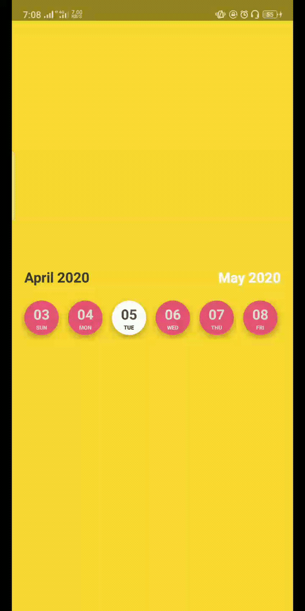
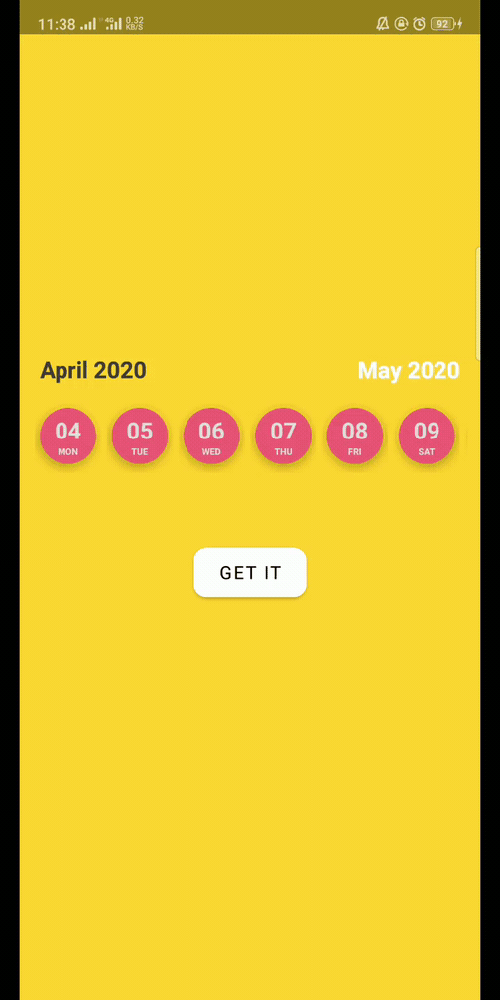

# EsCalendarView
highly Customizable Horizontal future Calendar view starts from today for selections in the future.
| One             |  Two                         |
:-------------------------:|:-------------------------:
|  |  |

## Including in your project
[](https://jitpack.io/#EsmaeelNabil/EsCalendarView)
### Gradle 
Add below codes to your **root** `build.gradle` file (not your module build.gradle file).
```gradle
allprojects {
    repositories {
    	....
	maven { url 'https://jitpack.io' }
    }
}
```
And add a dependency code to your **APP**'s `build.gradle` file. [](https://jitpack.io/#EsmaeelNabil/EsCalendarView)
```gradle
dependencies {
	  implementation 'com.github.EsmaeelNabil:EsCalendarView:2.0'
}
```

## Usage

Add following XML inside your XML layout file.

### EsCalendarView XML

```gradle
<com.esmaeel.calendarlibrary.EsCalendarView
        app:previousMonthTextSize="@dimen/_5ssp"
        app:previousMonthTextColor="@color/md_grey_900"
        app:currentMonthTextColor="@color/white"
        app:currentMonthTextSize="@dimen/_5ssp"
        android:paddingTop="8dp"
        android:id="@+id/myCalendar"
        android:layout_width="match_parent"
        android:layout_height="wrap_content"
        app:dayNameTextSize="@dimen/_2ssp"
        app:dayNumberTextSize="@dimen/_5ssp"
        app:includeToday="true"
        app:itemSize="@dimen/_40sdp"
        app:layout_constraintBottom_toBottomOf="parent"
        app:layout_constraintEnd_toEndOf="parent"
        app:layout_constraintStart_toStartOf="parent"
        app:layout_constraintTop_toTopOf="parent"
        app:normalDayBackgroundColor="@color/creemy_red"
        app:selectedDayNameTextColor="@color/header_black"
        app:selectedDayNumberTextColor="@color/black_light"
        app:selectedDayBackgroundColor="@color/white" />

```

# implementaion

```gradle
class MainActivity : AppCompatActivity(), EsCalendarListener {

    override fun onCreate(savedInstanceState: Bundle?) {
        super.onCreate(savedInstanceState)
        setContentView(R.layout.activity_main)

        myCalendar.setOnDateSelectedListener(this)

    }

    override fun onDateSelectedListener(model: DateModel?, position: Int) {
        Toast.makeText(applicationContext, model?.apiDate, Toast.LENGTH_LONG).show();
    }
}
```

# Attribues you can use in XML
```gradle

        name="arabicSupport"              ------->      boolean           : for supporting arabic & Rtl or not : default = true
        name="hidePreviousMonth"          ------->      boolean           : default = false
        name="hideCurrentMonth"           ------->      boolean           : default = false
        name="dateSplitChar"              ------->      String            : ( -, /, any char ) to change the date splitter
        name="DaysCount"                  ------->      Int
        name="includeToday"               ------->      boolean           : show today at first : default = false
        name="itemSize"                   ------->      Int ( dp / _sdp ) : Circle size of the item
        name="previousMonthTextSize"      ------->      Int ( dp / _sdp ) 
        name="currentMonthTextSize"       ------->      Int ( dp / _sdp )
        name="dayNumberTextSize"          ------->      Int ( dp / _sdp )
        name="dayNameTextSize"            ------->      Int ( dp / _sdp )
        name="monthNameTextSize"          ------->      Int ( dp / _sdp )    
        name="previousMonthTextColor"     ------->      color
        name="currentMonthTextColor"      ------->      color
        name="normalDayNumberTextColor"   ------->      color
        name="selectedDayNumberTextColor" ------->      color
        name="normalDayNameTextColor"     ------->      color
        name="selectedDayNameTextColor"   ------->      color
        name="normalMonthNameTextColor"   ------->      color
        name="selectedMonthNameTextColor" ------->      color
        name="calendarBackgroundColor"    ------->      color
        name="normalDayBackgroundColor"   ------->      color
        name="selectedDayBackgroundColor" ------->      color
```  
